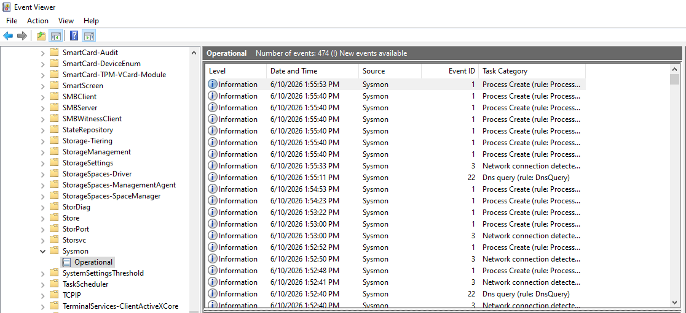
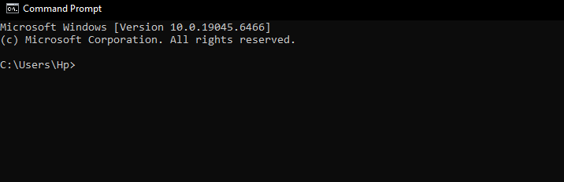
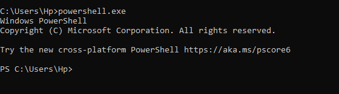
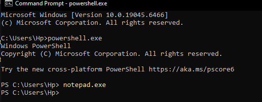
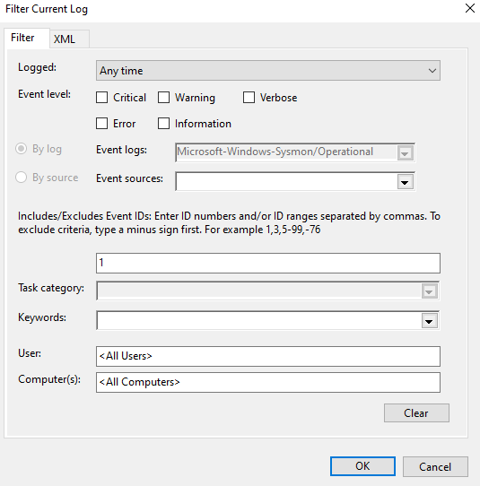

# Sysmon Process Tree Investigation

## Introduction

This project demonstrates the investigation of Windows process execution using Sysmon Event ID 1 (Process Creation).

The objective of the lab was to generate a controlled process chain, analyze Sysmon telemetry, investigate parent-child process relationships, and reconstruct the complete execution path of multiple processes.

Process tree analysis is a fundamental technique used by SOC analysts, incident responders, and threat hunters to understand how applications are launched, identify suspicious execution chains, and investigate potential malicious activity.

## Lab Environment

* Windows 10
* Sysmon
* Event Viewer

## Investigation Objectives

* Analyze Sysmon Event ID 1
* Investigate process creation events
* Identify parent-child process relationships
* Review command-line execution
* Reconstruct a process tree
* Understand process monitoring techniques

## 1. Sysmon Operational Log Review

The investigation began by accessing the Sysmon Operational log through Windows Event Viewer.

Sysmon provides enhanced visibility into process execution activity and records detailed information about newly created processes, including executable paths, command-line arguments, user context, and parent processes.

This telemetry is commonly used during threat hunting and incident response investigations.

---

## 2. Process Chain Generation

A controlled process chain was generated to create process creation events for analysis.

The following sequence was executed:

1. Command Prompt (cmd.exe) was launched manually.
2. PowerShell (powershell.exe) was launched from Command Prompt.
3. Notepad (notepad.exe) was launched from PowerShell.

This generated a clear parent-child process hierarchy that could later be reconstructed using Sysmon logs.

### Command Prompt Execution

### PowerShell Launched from CMD

### Complete Process Chain

---

## 3. Filtering Sysmon Event ID 1

The Sysmon Operational log was filtered using Event ID 1.

Event ID 1 represents Process Creation events and records detailed information every time a process starts within the operating system.

This event type is one of the most valuable telemetry sources used by SOC analysts during investigations.

